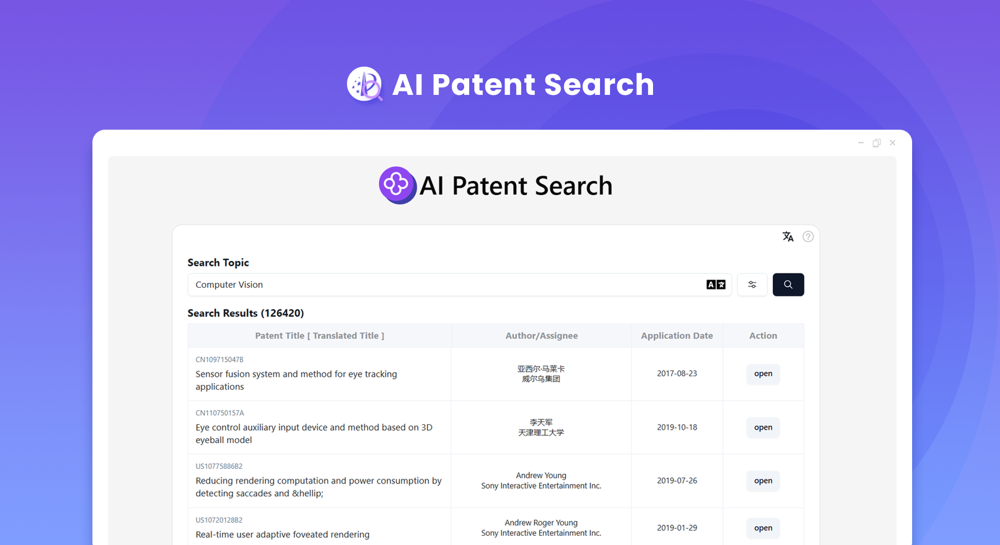
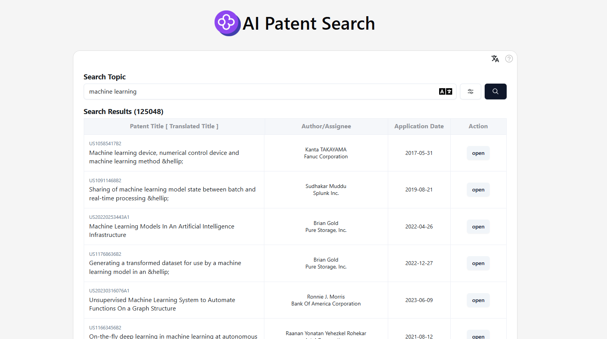
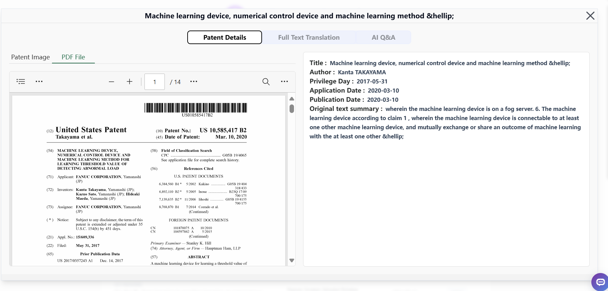
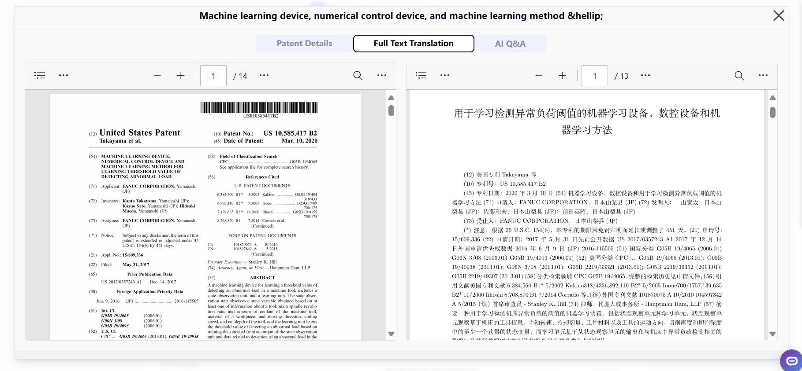
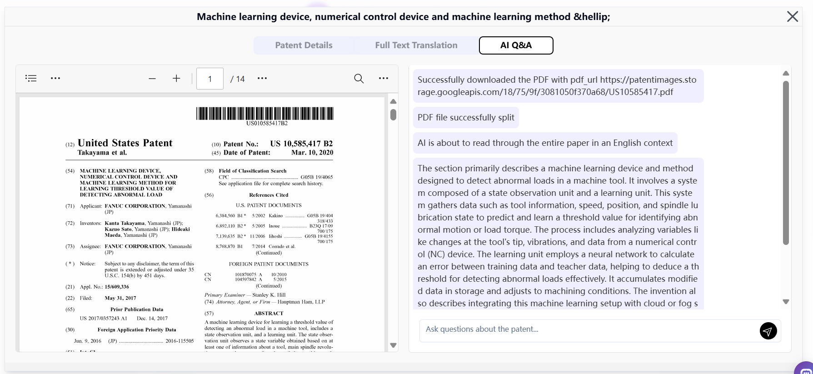

# 
✏️ AI Patent Search 🚀✨

AI patent search can quickly obtain the details, pictures and PDF files of patents through Google patent search. It can also filter according to various parameters such as patent offices and languages. With just one click, it can generate full-text summaries and full-text translations. Moreover, the content can be used as context to have conversations with AI large models, enabling users to quickly understand the detailed content of patents.

<a href="README_zh.md">中文</a> | <a href="README.md">English</a> | <a href="README_ja.md">日本語</a>

  

An open-source version of the [AI Patent Search](https://302.ai/en/tools/patent/) from [302.AI](https://302.ai/en/). You can log in directly to 302.AI to use the online version with zero code and zero configuration, or modify this project according to your own needs, input your API KEY from 302.AI, and deploy it yourself.

## Interface Preview
Filter according to the search theme and multiple parameters to quickly obtain relevant patents.
     

Obtain the details of patents.
    

Translate the full text of patents.
     

The content can be used as context to have a conversation with AI to quickly understand the detailed content of patents.

## Project Features
### Features
### 🔍 Patent Search
   - Integrates patent resources from various patent offices, enabling users to quickly access patent information from different regions.
   - Provides advanced search features, allowing users to filter by date, language, patent type, and more.

### 🔤 PDF Translation
   - Real-time translation of patent PDF content, supporting multiple languages.
   - Allows users to select the target language for multilingual access to document content.

### 🤖 AI Full Text Analysis
   - Utilizes AI technology to automatically parse the full text of patents, extracting key content and information.
   - Provides summaries and analysis of patent content, helping users quickly understand the core of a patent.

### 🧠 AI Q&A System
   - Offers intelligent Q&A functionality, allowing users to ask questions about specific patent texts.
   - AI generates answers in real-time based on patent content, improving the efficiency of information retrieval.

### 🌍 Multi-language Support
- Chinese Interface
- English Interface
- Japanese Interface

With AI Patent Search, we can easily and quickly access patent information from different regions. 🎉💻 Let's explore the AI-driven world of coding together! 🌟🚀

## 🚩 Future Update Plans 
- [ ] Expand multiple data sources and integrate more resources from authoritative patent databases

## Tech Stack
- React
- Tailwind CSS
- Shadcn UI

## Development & Deployment
1. Clone the project `git clone https://github.com/302ai/302_patent_search`
2. Install dependencies `npm install`
3. Configure the 302 API KEY based on .env.example
4. Run the project `npm dev`
5. Build and deploy `docker build -t patent-search . && docker run -p 3000:80 patent-search`

## ✨ About 302.AI ✨

[302.AI](https://302.ai) is an enterprise-oriented AI application platform that offers pay-as-you-go services, ready-to-use solutions, and an open-source ecosystem.✨
1. 🧠 It integrates the latest and most complete AI capabilities and brands, including but not limited to language models, image models, sound models, video models.
2. 🚀 Deep application development on foundational models, developing real AI products rather than simple chatbots.
3. 💰 Zero monthly fee, all features are pay-as-you-go, fully open to truly lower the threshold and increase the upper limit.
4. 🛠 A powerful management backend designed for teams and SMEs, allowing one-person management and multi-user access.
5. 🔗 All AI capabilities provide API access, and all tools are open source for customization (in progress).
6. 💡 A strong development team, releasing 2-3 new applications every week, with daily product updates. Developers interested in joining are welcome to contact us.
