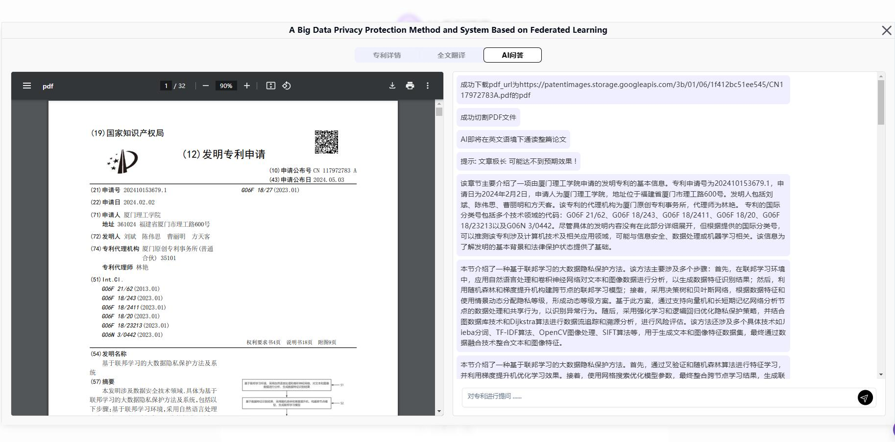

# 💻🤖 302.AIのAI特許検索へようこそ! 🚀✨

[中文](README_zh.md) | [English](README.md) | [日本語](README_ja.md)

[302.AI](https://302.ai)から提供される[AI特許検索](https://302.ai/tools/patent/)のオープンソースバージョンです。
直接302.AIにログインして、コード不要でオンラインバージョンを利用できます。
または、プロジェクトを自分のニーズに合わせて変更し、302.AIのAPIキーを入力して自己展開することも可能です。

## ✨ 302.AIの紹介 ✨

[302.AI](https://302.ai)は、AIを実践で活用するためのラストワンマイル問題を解決する、オンデマンドのAIアプリケーションプラットフォームです。
1. 🧠 最新かつ最も完全なAI機能とブランドを集めています。言語モデル、画像モデル、音声モデル、ビデオモデルなどが含まれます。
2. 🚀 基本モデルに基づいて深いアプリケーション開発を行い、単なるチャットボットではない本物のAI製品を開発します。
3. 💰 月額料金ゼロで、すべての機能は必要に応じて利用料を支払い、全面的に開放されています。真の低価格、高上限を実現します。
4. 🛠 強力な管理バックエンドを備え、チームや中小企業向けに、一人で管理、複数人で使用することができます。
5. 🔗 すべてのAI能力はAPI接続を提供し、すべてのツールはオープンソースで、自由にカスタマイズ（進行中）可能です。
6. 💡 強力な開発チームが毎週2～3本の新しいアプリケーションをリリースし、毎日製品を更新します。興味のある開発者はぜひご連絡ください。

## プロジェクト特徴

1. **🔍 特許検索**：
   - 各特許局の特許リソースを統合し、ユーザーが異なる地域の特許情報を迅速に取得できるようにします。
   - 日付、言語、特許の種類など、複数のディメンションでフィルタリングする高度な検索機能を提供します。

2. **🔤 PDF翻訳機能**：
   - 特許PDFの内容をリアルタイムで翻訳し、多言語翻訳をサポートします。
   - ユーザーが目的の言語を選択して、文書内容の多言語アクセスを実現できるようにします。

3. **🤖 AI全文解析**：
   - AI技術を採用し、特許全文を自動的に解析して重要な内容や情報を抽出します。
   - 特許内容の概要と分析情報を提供し、ユーザーが特許の核心を迅速に理解できるようにします。

4. **🧠 AI質問応答システム**：
   - インテリジェントな質問応答機能を提供し、ユーザーは特定の特許テキストに関する質問をすることができます。
   - AIは特許内容に基づいてリアルタイムで回答を生成し、情報取得の効率を向上させます。

5. 🌐 完全な国際化：日本語、英語、中国語のインターフェース切り替えをサポートします。

AI特許検索を通じて、私たちは異なる地域の特許情報を簡単に迅速に取得できます。 🎉💻 AI駆動の新しい世界を一緒に探索しましょう! 🌟🚀

## 技術スタック

- React
- Tailwind CSS
- Shadcn UI

## 開発＆デプロイ
1. プロジェクトをクローン `git clone https://github.com/302ai/302_patent_search`
2. 依存関係のインストール `npm install`
3. 302のAPIキーを設定する .env.example を参考にしてください
4. プロジェクトを実行 `npm dev`
5. ビルドとデプロイ `docker build -t patent-search . && docker run -p 3000:80 patent-search`

## インターフェースプレビュー

