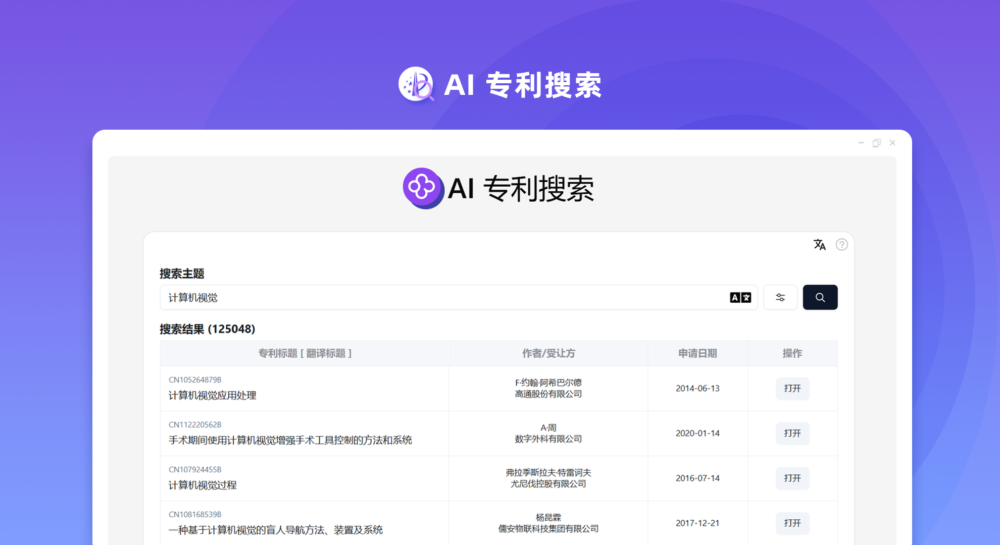
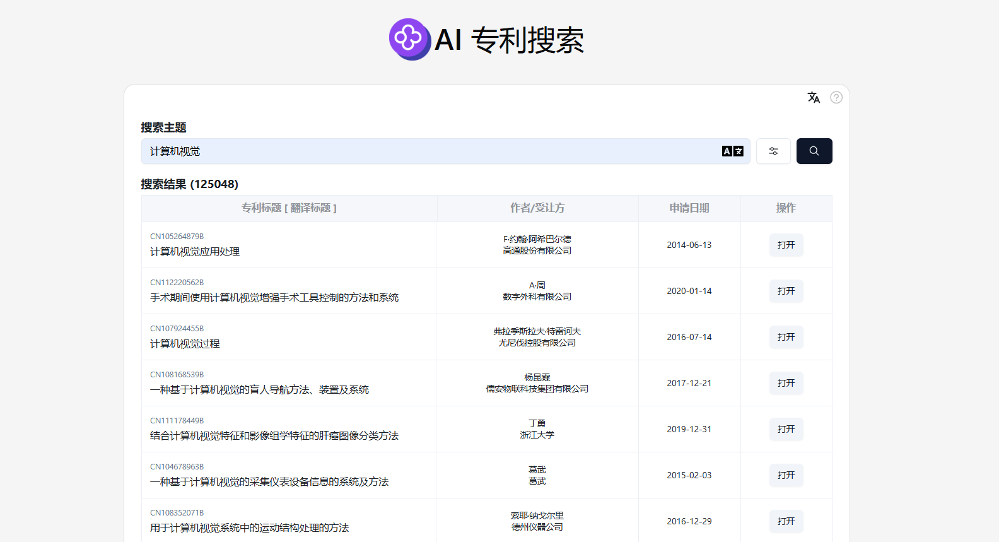
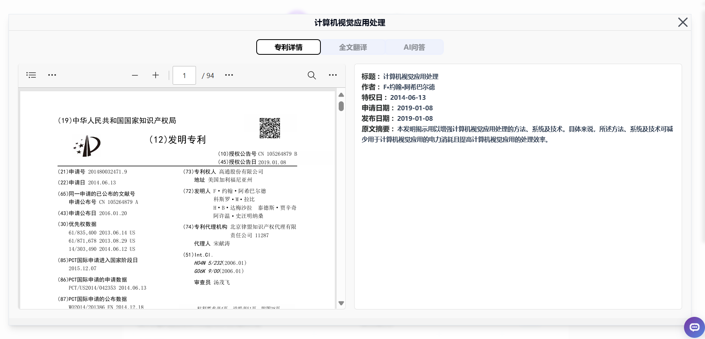
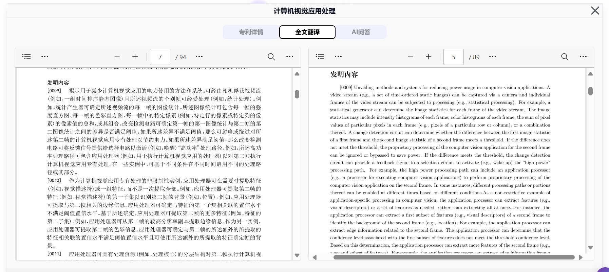
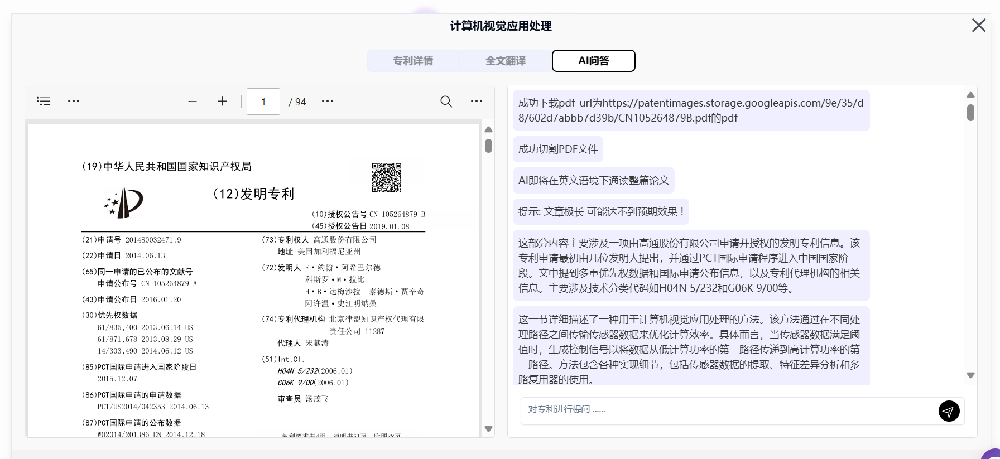

# 
 ✏️ AI 专利搜索 🚀✨

AI专利搜索通过Google专利搜索快速获取专利的详情、图片和PDF文件，还可以根据专利局和语言等多种参数进行筛选，一键生成全文摘要、全文翻译，还可以将内容作为上下文与AI大模型进行对话，快速了解专利的详细内容。

<a href="README_zh.md">中文</a> | <a href="README.md">English</a> | <a href="README_ja.md">日本語</a>

   

来自[302.AI](https://302.ai)的[AI 专利搜索](https://302.ai/tools/patent/)的开源版本。
你可以直接登录302.AI，零代码零配置使用在线版本。
或者对本项目根据自己的需求进行修改，传入302.AI的API KEY，自行部署。

## 界面预览
根据搜索主题和多种参数进行筛选，快速获取相关专利。
     

获取专利详情。
    

对专利进行全文翻译。
     

可将内容作为上下文与AI进行对话，快速了解专利的详细内容。

## 项目特性
1. **🔍专利搜索**：
   - 集成各个专利局的专利资源，方便用户快速获取不同区域的专利信息。
   - 提供高级搜索功能，允许用户根据日期、语言、专利类型等多个维度进行筛选。

2. **🔤PDF翻译功能**：
   - 实时翻译专利PDF内容，支持多语言翻译。
   - 允许用户选择目标语言以实现文档内容的多语言化访问。

3. **🤖AI全文解析**：
   - 采用 AI 技术自动解析专利全文，提取关键内容和信息。
   - 提供专利内容的概要和分析信息，帮助用户快速理解专利核心。

4. **🧠AI问答系统**：
   - 提供智能问答功能，用户可以针对特定专利文本进行提问。
   - AI 根据专利内容实时生成答案，提高用户获取信息的效率。

5. **🌍 多语言支持**：
   - 中文界面
   - English Interface
   - 日本語インターフェース

通过AI 专利搜索,我们能方便快速获取不同区域的专利信息。 🎉💻 让我们一起探索AI驱动的代码新世界吧! 🌟🚀

## 🚩 未来更新计划
- [ ] 多数据源拓展，整合更多权威专利数据库资源
  
## 技术栈
- React
- Tailwind CSS
- Shadcn UI

## 开发&部署
1. 克隆项目 `git clone https://github.com/302ai/302_patent_search`
2. 安装依赖 `npm install`
3. 配置302的API KEY 参考.env.example
4. 运行项目 `npm dev`
5. 打包部署 `docker build -t patent-search . && docker run -p 3000:80 patent-search`

## ✨ 302.AI介绍 ✨
[302.AI](https://302.ai)是一个面向企业的AI应用平台，按需付费，开箱即用，开源生态。✨
1. 🧠 集合了最新最全的AI能力和品牌，包括但不限于语言模型、图像模型、声音模型、视频模型。
2. 🚀 在基础模型上进行深度应用开发，我们开发真正的AI产品，而不是简单的对话机器人
3. 💰 零月费，所有功能按需付费，全面开放，做到真正的门槛低，上限高。
4. 🛠 功能强大的管理后台，面向团队和中小企业，一人管理，多人使用。
5. 🔗 所有AI能力均提供API接入，所有工具开源可自行定制（进行中）。
6. 💡 强大的开发团队，每周推出2-3个新应用，产品每日更新。有兴趣加入的开发者也欢迎联系我们
